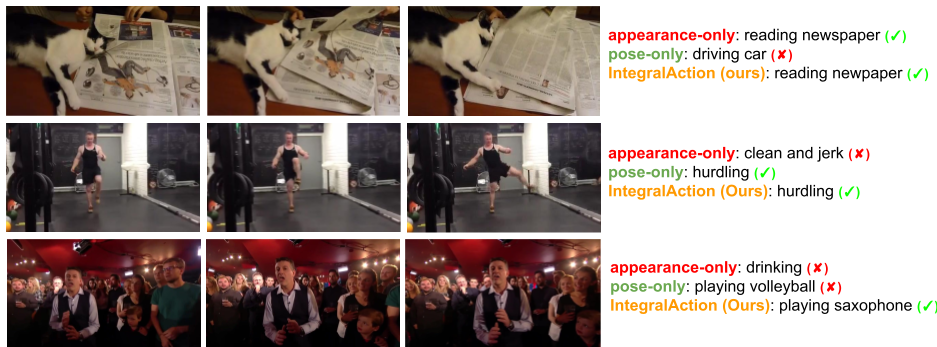
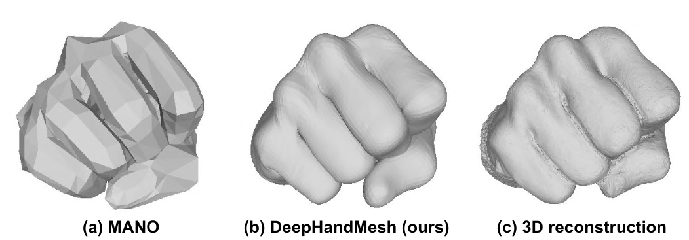
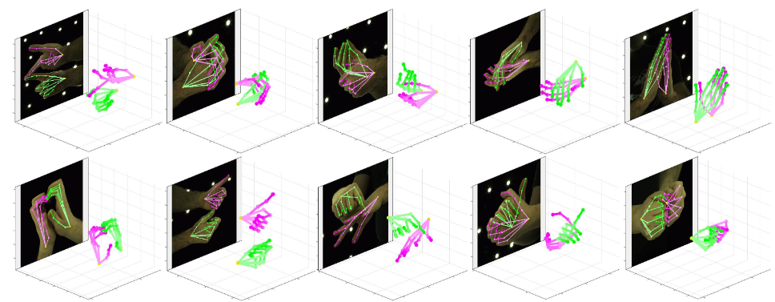
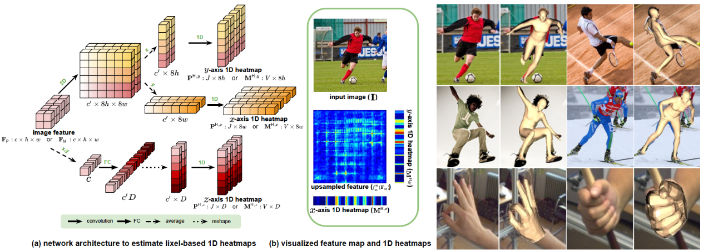
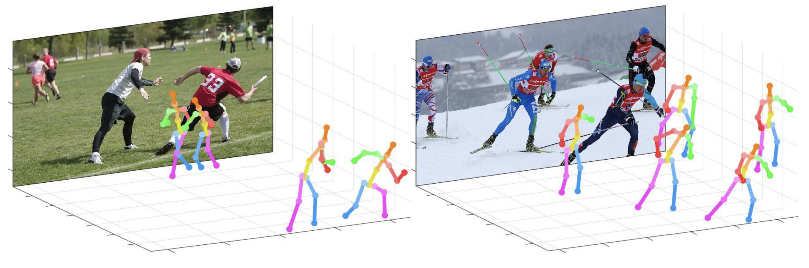
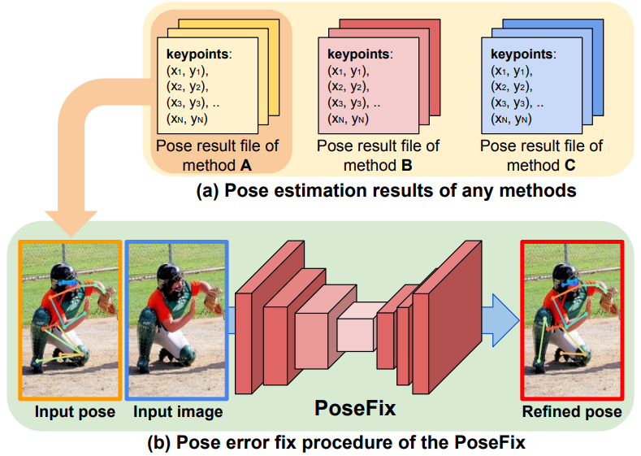
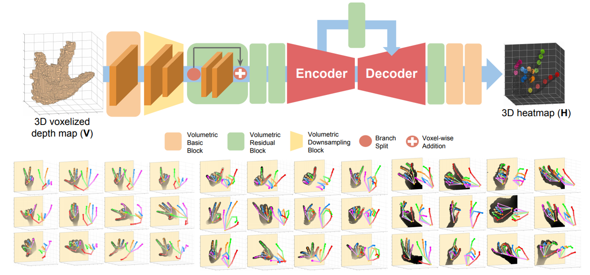
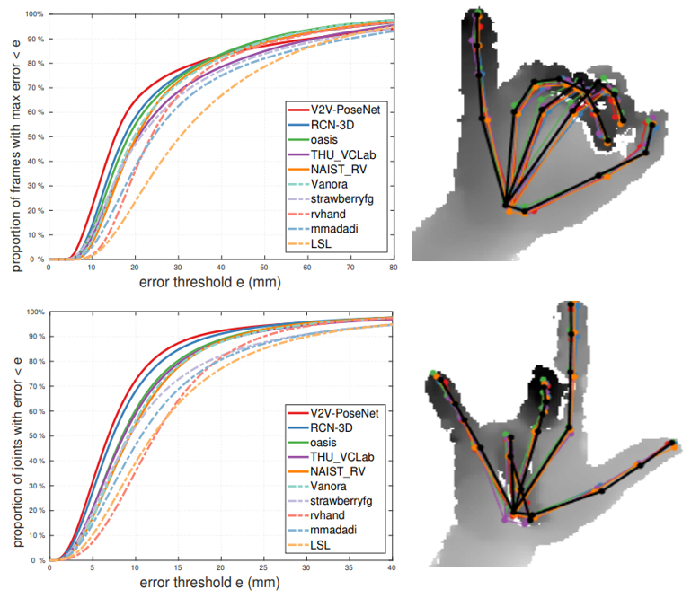
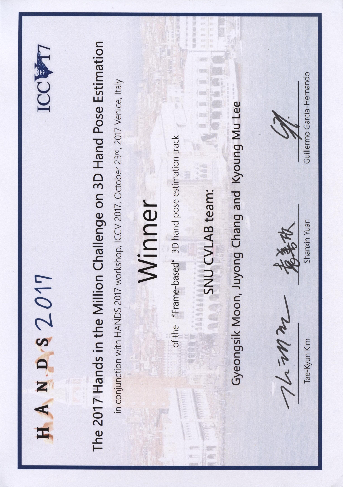

# Gyeongsik Moon
{: height="250px" width="250px" .align-right}

## Postdoctoral Research Scientist
I am currently a Visiting Researcher of Naver CLOVA AI Lab.
I will join Meta (Facebook Reality Labs) as a Postdoctoral Researcher Scientist in June, 2022.

Email: **mks0601@gmail.com** \
[Google Scholar](https://scholar.google.co.kr/citations?user=2f2D258AAAAJ&hl=en) \
[CV](CV.pdf) \
[Github](https://github.com/mks0601)

### Research Interests
Human-understanding computer vision, which includes 3D human reconstruction and human behavior recognition.

### Publications (Selected)

<!--HandOccNet-->

<b>  HandOccNet: Occlusion-Robust 3D Hand Mesh Estimation Network  </b>
 
JoonKyu Park (*), Yeonguk Oh (*), <b> Gyeongsik Moon (*) </b>, Hongsuk Choi, Kyoung Mu Lee <b>(* equal contribution)</b>
 
In <b> CVPR 2022 </b>
 
[<a href="https://arxiv.org/abs/2203.14564">ARXIV</a>] [<a href="https://github.com/namepllet/HandOccNet">CODE</a>]

 

<!--3DCrowdNet-->

<b>  Learning to Estimate Robust 3D Human Mesh from In-the-Wild Crowded Scenes  </b>
 
Hongsuk Choi, <b> Gyeongsik Moon</b>, JoonKyu Park, Kyoung Mu Lee
 
In <b> CVPR 2022 </b>
 
[<a href="https://arxiv.org/abs/2104.07300">ARXIV</a>] [<a href="https://github.com/hongsukchoi/3DCrowdNet_RELEASE">CODE</a>]

 

<!--Hand4Whole-->

<b>  Accurate 3D Hand Pose Estimation for Whole-Body 3D Human Mesh Estimation  </b>
 
<b> Gyeongsik Moon</b>, Hongsuk Choi, Kyoung Mu Lee
 
In <b> CVPRW 2022 </b>
 
[<a href="https://arxiv.org/abs/2011.11534">ARXIV</a>] [<a href="https://youtu.be/Ym_CH8yxBso">VIDEO</a>] [<a href="https://github.com/mks0601/Hand4Whole_RELEASE">CODE</a>]

 

<!--NeuralAnnot-->

<b>  NeuralAnnot: Neural Annotator for 3D Human Mesh Training Sets  </b>
 
<b> Gyeongsik Moon</b>, Hongsuk Choi, Kyoung Mu Lee
 
In <b> CVPRW 2022 </b>
 
[<a href="https://arxiv.org/abs/2011.11232">ARXIV</a>] [<a href="https://github.com/mks0601/NeuralAnnot_RELEASE">HOMEPAGE</a>]

 

<!--TCMR-->

<b>  Beyond Static Features for Temporally Consistent 3D Human Pose and Shape from a Video  </b>
 
Hongsuk Choi, <b> Gyeongsik Moon</b>, Ju Yong Chang, Kyoung Mu Lee
 
In <b> CVPR 2021 </b>
 
[<a href="https://arxiv.org/abs/2011.08627">ARXIV</a>] [<a href="https://openaccess.thecvf.com/content/CVPR2021/papers/Choi_Beyond_Static_Features_for_Temporally_Consistent_3D_Human_Pose_and_CVPR_2021_paper.pdf">PDF</a>] [<a href="https://github.com/hongsukchoi/TCMR_RELEASE">CODE</a>] [<a href="https://www.youtube.com/watch?v=WB3nTnSQDII">VIDEO</a>]

 

<!--IntegralAction-->

<b>  IntegralAction: Pose-driven Feature Integration for Robust Human Action Recognition in Videos  </b>
 
<b> Gyeongsik Moon (*) </b>, Heeseung Kwon (*), Kyoung Mu Lee, Minsu Cho <b>(* equal contribution)</b>
 
In <b> CVPRW 2021 (Oral.) </b>
 
[<a href="https://arxiv.org/abs/2007.06317">ARXIV</a>] [<a href="https://openaccess.thecvf.com/content/CVPR2021W/HVU/papers/Moon_IntegralAction_Pose-Driven_Feature_Integration_for_Robust_Human_Action_Recognition_in_CVPRW_2021_paper.pdf">PDF</a>] [<a href="https://github.com/mks0601/IntegralAction_RELEASE">CODE</a>]

 

<!--DeepHandMesh-->

<b>  DeepHandMesh: A Weakly-Supervised Deep Encoder-Decoder Framework for High-Fidelity Hand Mesh Modeling  </b>
 
<b> Gyeongsik Moon</b>, Takaaki Shiratori, Kyoung Mu Lee
 
In <b> ECCV 2020 (Oral. top 2%) </b>
 
[<a href="https://mks0601.github.io/DeepHandMesh/">DATASET</a>] [<a href="https://arxiv.org/abs/2008.08213">ARXIV</a>] [<a href="https://www.ecva.net/papers/eccv_2020/papers_ECCV/papers/123470426.pdf">PDF</a>] [<a href="https://github.com/facebookresearch/DeepHandMesh">CODE</a>] [<a href="https://youtu.be/KflEovYApsk">VIDEO</a>]

 

<!--InterHand2.6M-->

<b>  InterHand2.6M: A Dataset and Baseline for 3D Interacting Hand Pose Estimation from a Single RGB Image  </b>
 
<b> Gyeongsik Moon</b>, Shoou-i Yu, He Wen, Takaaki Shiratori, Kyoung Mu Lee
 
In <b> ECCV 2020 </b>
 
[<a href="https://mks0601.github.io/InterHand2.6M/">DATASET</a>] [<a href="https://arxiv.org/abs/2008.09309">ARXIV</a>] [<a href="https://www.ecva.net/papers/eccv_2020/papers_ECCV/papers/123650545.pdf">PDF</a>] [<a href="https://github.com/facebookresearch/InterHand2.6M">CODE</a>] [<a href="https://youtu.be/h66jFalMpDQ">VIDEO</a>]

 

<!--I2L-MeshNet-->

<b>  I2L-MeshNet: Image-to-Lixel Prediction Network for Accurate 3D Human Pose and Mesh Estimation from a Single RGB Image  </b>
 
<b> Gyeongsik Moon</b>, Kyoung Mu Lee
 
In <b> ECCV 2020 </b> (<b> Winners </b> and <b> 2nd place </b> of the <b> 3D human pose estimation in the wild (3DPW) challenge </b>)
 
[<a href="https://arxiv.org/abs/2008.03713">ARXIV</a>] [<a href="https://www.ecva.net/papers/eccv_2020/papers_ECCV/papers/123520732.pdf">PDF</a>] [<a href="https://github.com/mks0601/I2L-MeshNet_RELEASE">CODE</a>] [<a href="https://youtu.be/vIF9s71QrP0">VIDEO</a>]

 

<!--Pose2Mesh-->

<b>  Pose2Mesh: Graph Convolutional Network for 3D Human Pose and Mesh Recovery from a 2D Human Pose  </b>
 
Hongsuk Choi (*), <b> Gyeongsik Moon (*) </b>, Kyoung Mu Lee <b>(* equal contribution)</b>
 
In <b> ECCV 2020 </b>
 
[<a href="https://arxiv.org/abs/2008.09047">ARXIV</a>] [<a href="https://www.ecva.net/papers/eccv_2020/papers_ECCV/papers/123520749.pdf">PDF</a>] [<a href="https://github.com/hongsukchoi/Pose2Mesh_RELEASE">CODE</a>] [<a href="https://youtu.be/utaHeByNauc">VIDEO</a>]

 

<!--3DMPPE-->

<b>  Camera Distance-aware Top-down Approach for 3D Multi-person Pose Estimation from a Single RGB Image  </b>
 
<b> Gyeongsik Moon</b>, Ju Yong Chang, Kyoung Mu Lee
 
In <b> ICCV 2019 </b>
 
[<a href="https://arxiv.org/abs/1907.11346">ARXIV</a>] [<a href="http://openaccess.thecvf.com/content_ICCV_2019/papers/Moon_Camera_Distance-Aware_Top-Down_Approach_for_3D_Multi-Person_Pose_Estimation_From_ICCV_2019_paper.pdf">PDF</a>] [<a href="https://github.com/mks0601/3DMPPE_ROOTNET_RELEASE">CODE (ROOTNET)</a>] [<a href="https://github.com/mks0601/3DMPPE_POSENET_RELEASE">CODE (POSENET)</a>]

 

<!--PoseFix-->

<b>  PoseFix: Model-agnostic General Human Pose Refinement Network  </b>
 
<b> Gyeongsik Moon</b>, Ju Yong Chang, Kyoung Mu Lee
 
In <b> CVPR 2019 </b>
 
[<a href="https://arxiv.org/abs/1812.03595">ARXIV</a>] [<a href="http://openaccess.thecvf.com/content_CVPR_2019/papers/Moon_PoseFix_Model-Agnostic_General_Human_Pose_Refinement_Network_CVPR_2019_paper.pdf">PDF</a>] [<a href="https://github.com/mks0601/PoseFix_RELEASE">CODE</a>]

 

<!--MSA R-CNN-->

<b>  Multi-scale Aggregation R-CNN for 2D Multi-person Pose Estimation  </b>
 
<b> Gyeongsik Moon</b>, Ju Yong Chang, Kyoung Mu Lee
 
In <b> CVPRW 2019 </b>
 
[<a href="https://arxiv.org/abs/1905.03912">ARXIV</a>] [<a href="http://openaccess.thecvf.com/content_CVPRW_2019/papers/Augmented%20Human%20Human-centric%20Understanding%20and%202D-3D%20Synthesis/Moon_Multi-scale_Aggregation_R-CNN_for_2D_Multi-person_Pose_Estimation_CVPRW_2019_paper.pdf">PDF</a>]

 

<!--V2V-PoseNet-->

<b>  V2V-PoseNet: Voxel-to-Voxel Prediction Network for Accurate 3D Hand and Human Pose Estimation from a Single Depth Map  </b> 
 
<b> Gyeongsik Moon</b>, Ju Yong Chang, Kyoung Mu Lee
 
In <b> CVPR 2018 </b> (<b> Winners </b> of the <b> HANDS 2017 3D hand pose estimation challenge </b>)
 
[<a href="https://arxiv.org/abs/1711.07399">ARXIV</a>] [<a href="http://openaccess.thecvf.com/content_cvpr_2018/papers/Moon_V2V-PoseNet_Voxel-to-Voxel_Prediction_CVPR_2018_paper.pdf">PDF</a>] [<a href="https://github.com/mks0601/V2V-PoseNet_RELEASE">CODE</a>]

 

<!--HANDS 2017-->

<b>  Depth-based 3D Hand Pose Estimation: From Current Achievements to Future Goals  </b>
 
Shanxin Yuan, Guillermo Garcia-Hernando, Björn Stenger, <b> Gyeongsik Moon</b>, Ju Yong Chang, Kyoung Mu Lee, ..., Tae-Kyun Kim
 
In <b> CVPR 2018 </b>
 
[<a href="https://arxiv.org/abs/1712.03917">ARXIV</a>] [<a href="http://openaccess.thecvf.com/content_cvpr_2018/papers/Yuan_Depth-Based_3D_Hand_CVPR_2018_paper.pdf">PDF</a>]

 

### Honors

<b>Doctoral Consortium at CVPR 2021</b>.

<b>Samsung Humantech Paper Award Silver Prize</b> (Computer Science and Engineering, 2021).

<b>SNU Distinguished Ph.D. Dissertation Award / Best Thesis Award</b> (2021).

<b>Qualcomm Innovation Fellowship</b> (2020).

<b>Google Ph.D. Fellowship</b> (Computer Vision, 2020).

  <b>1st place</b> and <b>2nd place</b> at the <b>3D human pose estimation in the wild (3DPW) challenge</b> of a without association track in joint orientation and position metrics, respectively   (workshop in conjunction with <b>ECCV 2020</b>).

  <b>1st place</b> at the <b>HANDS 2017 3D hand pose estimation challenge</b> of a frame-based track (workshop in conjunction with <b>ICCV 2017</b>).

### Service
* A Reviewer for computer vision and machine learning conferences.
    * <b>CVPR</b> (2020, 2021, and 2022), <b>ICCV</b> (2021), <b>ECCV</b> (2020 and 2022), <b>ICLR</b> (2022), <b>NeurIPS</b> (2022), <b>AAAI</b> (2022), WACV (2021 and 2022), and ACCV (2020).
* A Reviewer for computer vision journals.
    * <b>TPAMI</b>, IJCV, CVIU, Neurocomputing, IEEE TIP/TOM/Access, Signal Processing: Image Communication, and others. 

### Experience

  <b>Postdoctoral Research Scientist</b>, <b>Meta (Facebook Reality Labs)</b>, Pittsburgh, PA, USA   (Jun. 2022 - Jun. 2024)

  <b>Visiting Researcher</b>, <b>Naver CLOVA AI Lab</b>, Seoul, Korea   (Mar. 2022 - May. 2022)

  <b>Visiting Researcher</b>, <b>Naver Labs Europe (NLE)</b>, Meylan, France   (Jun. 2021 - Dec. 2021)

  <b>Postdoctoral Researcher</b>, EE, <b>Seoul National University (SNU)</b>, Seoul, Korea   (Mar. 2021 - Feb. 2022)

  <b>Research Internship</b>, <b>Meta (Facebook Reality Labs)</b>, Pittsburgh, PA, USA   (Apr. 2019 - Sep. 2019)

  <b>MS., Ph.D</b>, EE, <b>Seoul National University (SNU)</b>, Seoul, Korea   (Sep. 2015 - Feb. 2021)

  <b>Bachelor</b>, CSE, <b>Pohang University of Science and Technology (POSTECH)</b>, Pohang, Korea   (Mar. 2011 - Aug. 2015)

### Press
* (21.02.) Korean press covered my Qualcomm Innovation Fellowship award [[EtNews](https://www.etnews.com/20210201000148)] [[SNU NOW](https://now.snu.ac.kr/category/3/33)]
* (20.10.) Korean press covered my Google Ph.D. Fellowship award [[SNU news](https://ee.snu.ac.kr/community/news?bm=v&bbsidx=50605)] [[AITIMES](http://www.aitimes.kr/news/articleView.html?idxno=17974&fbclid=IwAR1gHnivKI38nHlHjV8qplhViL-sEEs9cf4VRnfi7ce8wN3IOXSd-9SuKkI)]
* (20.08.) Korean press covered my four first-authored paper publications at ECCV 2020 [[SNU news](https://eng.snu.ac.kr/node/18742)] [[EtNews](https://www.etnews.com/20200818000451?m=1)] [[AITIMES](https://www.aitimes.kr/news/articleView.html?idxno=17397)]
* (17.10.) Korean press covered my HANDS 2017 challenge winning [[SNU news](https://eng.snu.ac.kr/node/15116)] [[Seoul Economy](https://www.sedaily.com/NewsVIew/1OMI5VVZJJ)] [[Finalcial News](https://www.fnnews.com/news/201710302018293746)]

