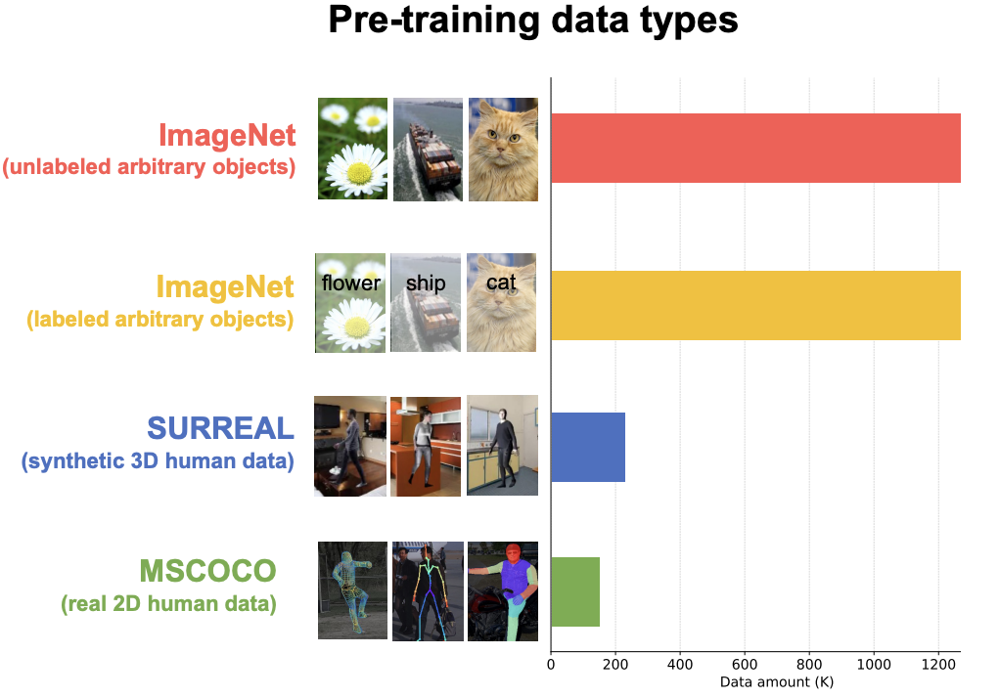
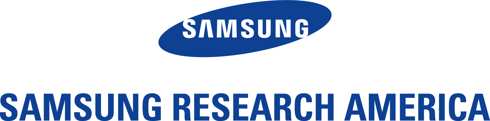

## Hongsuk Benjamin Choi
{: style="float: left; width: 175px; height: 225px; margin-right: 1em; margin-top: 0.5em  "}

### ML/CV Researcher
I am currently an ML/CV Researcher at Samsung AI center, New York. Please refer to my CV for more information! **[CV](CV_Hongsuk_Choi_Feb2023.pdf)**

Email: **redstonepo@gmail.com** \
[Google Scholar](https://scholar.google.com/citations?user=CZbowncAAAAJ&hl=en) \
[Linkedin](https://www.linkedin.com/in/hongsuk-choi-6b081a143/) \
[Github](https://github.com/hongsukchoi)

        
 

### Research Interests
3D comptuer vision related to motion capture, human hand &  body reconstruction, and robotics perception.

 

### Publications (Selected)

<!--Rethinking-->

<b> Rethinking Self-Supervised Visual Representation Learning in Pre-training for 3D Human Pose and Shape Estimation </b>
 
<b>Hongsuk Choi (*)</b>, Hyeongjin Nam (*), Taeryung Lee, Gyeongsik Moon, Kyoung Mu Lee <b>(* equal contribution)</b>
 
In <b>ICLR 2023</b>
 
[ARXIV] 
<!-- [<a href="https://arxiv.org/abs/2210.00627">ARXIV</a>] [<a href="https://youtu.be/9-hfGf7dRw4">VIDEO</a>] -->

 

<!--MonoNHR-->

<b> MonoNHR: Monocular Neural Human Renderer </b>
 
<b>Hongsuk Choi (*)</b>, Gyeongsik Moon (*), Matthieu Armando, Vincent Leroy, Kyoung Mu Lee, Gregory Rogez <b>(* equal contribution)</b>
 
In <b>3DV 2022</b>
 
[<a href="https://arxiv.org/abs/2210.00627">ARXIV</a>] [<a href="https://youtu.be/9-hfGf7dRw4">VIDEO</a>]

 

<!--HandOccNet-->

<b>  HandOccNet: Occlusion-Robust 3D Hand Mesh Estimation Network  </b>
 
JoonKyu Park (*), Yeonguk Oh (*), Gyeongsik Moon (*), <b>Hongsuk Choi</b>, Kyoung Mu Lee <b>(* equal contribution)</b>
 
In <b>CVPR 2022</b>
 
[<a href="https://arxiv.org/abs/2203.14564">ARXIV</a>] [<a href="https://github.com/namepllet/HandOccNet">CODE</a>]

 

<!--3DCrowdNet-->

<b>  Learning to Estimate Robust 3D Human Mesh from In-the-Wild Crowded Scenes  </b>
 
<b>Hongsuk Choi</b>, Gyeongsik Moon, JoonKyu Park, Kyoung Mu Lee
 
In <b>CVPR 2022</b>
 
[<a href="https://arxiv.org/abs/2104.07300">ARXIV</a>] [<a href="https://github.com/hongsukchoi/3DCrowdNet_RELEASE">CODE</a>]

 

<!--Hand4Whole-->

<b>  Accurate 3D Hand Pose Estimation for Whole-Body 3D Human Mesh Estimation  </b>
 
Gyeongsik Moon, <b>Hongsuk Choi</b>, Kyoung Mu Lee
 
In <b>CVPRW 2022</b>
 
[<a href="https://arxiv.org/abs/2011.11534">ARXIV</a>] [<a href="https://youtu.be/Ym_CH8yxBso">VIDEO</a>] [<a href="https://github.com/mks0601/Hand4Whole_RELEASE">CODE</a>]

 

<!--NeuralAnnot-->

<b>  NeuralAnnot: Neural Annotator for 3D Human Mesh Training Sets  </b>
 
Gyeongsik Moon, <b>Hongsuk Choi</b>, Kyoung Mu Lee
 
In <b>CVPRW 2022</b>
 
[<a href="https://arxiv.org/abs/2011.11232">ARXIV</a>] [<a href="https://github.com/mks0601/NeuralAnnot_RELEASE">HOMEPAGE</a>]

 

<!--TCMR-->

<b>  Beyond Static Features for Temporally Consistent 3D Human Pose and Shape from a Video  </b>
 
<b>Hongsuk Choi</b>, Gyeongsik Moon, Ju Yong Chang, Kyoung Mu Lee
 
In <b>CVPR 2021</b>
 
[<a href="https://arxiv.org/abs/2011.08627">ARXIV</a>] [<a href="https://openaccess.thecvf.com/content/CVPR2021/papers/Choi_Beyond_Static_Features_for_Temporally_Consistent_3D_Human_Pose_and_CVPR_2021_paper.pdf">PDF</a>] [<a href="https://github.com/hongsukchoi/TCMR_RELEASE">CODE</a>] [<a href="https://www.youtube.com/watch?v=WB3nTnSQDII">VIDEO</a>]

 

<!--Pose2Mesh-->

<b>  Pose2Mesh: Graph Convolutional Network for 3D Human Pose and Mesh Recovery from a 2D Human Pose  </b>
 
<b>Hongsuk Choi (*)</b>,  Gyeongsik Moon (*) , Kyoung Mu Lee <b>(* equal contribution)</b>
 
In <b>ECCV 2020</b>
 
[<a href="https://arxiv.org/abs/2008.09047">ARXIV</a>] [<a href="https://www.ecva.net/papers/eccv_2020/papers_ECCV/papers/123520749.pdf">PDF</a>] [<a href="https://github.com/hongsukchoi/Pose2Mesh_RELEASE">CODE</a>] [<a href="https://youtu.be/utaHeByNauc">VIDEO</a>]

     

### Honors

<b>SNU Distinguished Master Dissertation Award</b> (2022)

  <b>1st place</b> and <b>2nd place</b> at the <b>3D human pose estimation in the wild (3DPW) challenge</b> of a without association track in joint orientation and position metrics, respectively   (workshop in conjunction with <b>ECCV 2020</b>)

<b>Qualcomm IT Tour 2019 presentation competition 1st place</b> (2019)

 

### Service
* A Reviewer for computer vision and machine learning conferences 
\- <b>CVPR</b>, <b>ICCV</b>, <b>ECCV</b> and others
* A Reviewer for computer vision journals
\- <b>TPAMI</b>, IEEE TIP and others

 

### Experience

  <b>ML research engineer</b>, <b>Samsung Research America</b>, New York, NY, USA   (Jun. 2022 - present)

  <b>Visiting Researcher</b>, <b>Naver CLOVA AI Lab</b>, Seoul, Korea   (Mar. 2022 - May. 2022)

  <b>Research Intern</b>, <b>Naver Labs Europe (NLE)</b>, Grenoble, France   (April. 2021 - Oct. 2021)

  <b>M.S.</b>, ECE, <b>Seoul National University (SNU)</b>, Seoul, Korea   (Mar. 2020 - Feb. 2022)

  <b>Repulic of Korea Airforce (ROKA)</b>, Gyeryong, Korea   (Mar. 2015 - Mar. 2017)

  <b>B.S.</b>, Business, CSE, <b>Seoul National University (SNU)</b>, Seoul, Korea   (Mar. 2013 - Feb. 2020)

